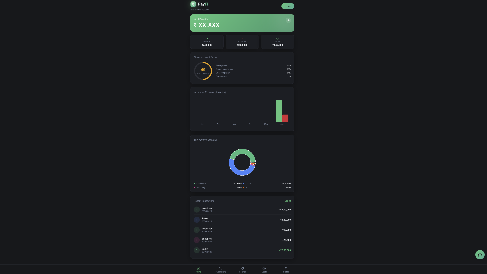
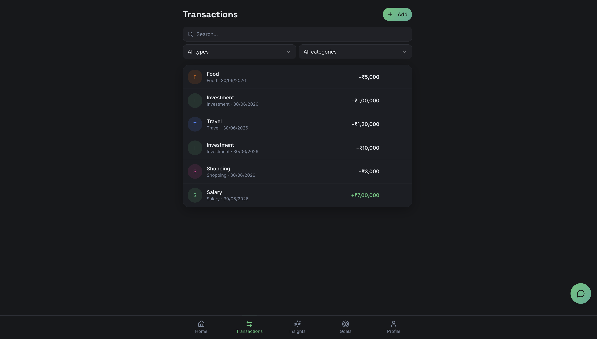
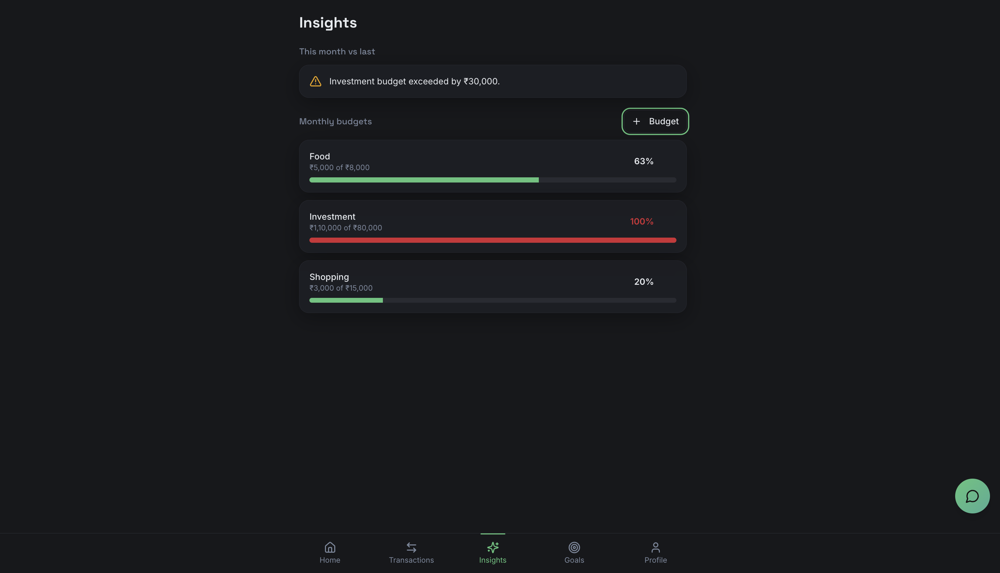
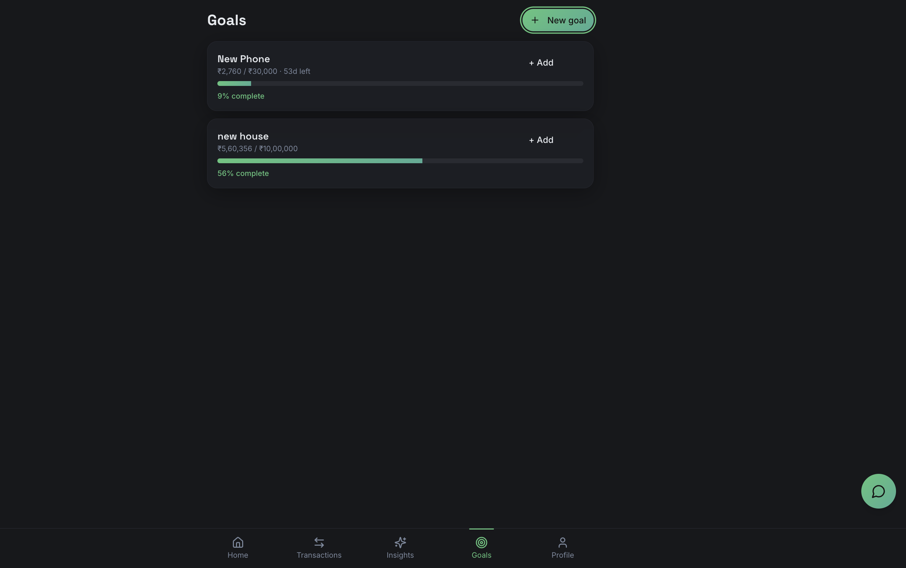

# P₹ PayFi

### Smart Finance App for Students

> Track expenses. Build habits. Hit your goals. — Built for students who want to stop guessing where their money went.

[Live Demo](will be updated soon) · [GitHub](https://github.com/poojadahiya22) · [Connect on LinkedIn](https://www.linkedin.com/in/pooja-dahiya-a04012297/)

</div>

---

## What is PayFi?

Most expense trackers are just digital notebooks. You log a transaction, forget about it, repeat.

PayFi is different. It's built around **understanding** your money — not just recording it. It analyzes your spending patterns, predicts your next month's expenses, coaches you through financial habits, and gamifies the hard part: actually saving.

Built specifically for college students who manage pocket money, juggle education costs, and are trying to build financial discipline for the first time.

> 🚧 Currently in active development. The full mobile app is planned — this README documents the web platform in its current form.

---

## 📸 Screenshots

### Dashboard



### Transactions



### Insights



## Goals


## PayFi AI


## 📸 Application Preview

<p align="center">


</p>

## Core Features

### Smart Dashboard
A personalized financial overview that updates in real time. Income vs. expense analytics, goal progress, health score — all in one place.

```
Good morning, Pooja 👋
This month: Spent ₹7,820 · Saved ₹4,580 · Health Score: 82/100
```

### AI Spending Coach
Analyzes your transaction history and surfaces patterns you wouldn't notice manually.

```
→ You spent 18% more on food this month
→ Your savings rate improved by 12% — keep it up
→ You're on track to hit your Laptop Fund goal by March
```

### Expense Prediction
Uses historical data to forecast your next month's spending by category — food, transport, education, and more — with trend graphs and AI-backed recommendations.

### Smart Budget Planner
Input your income and expense categories (pocket money, rent, food, transport, education, entertainment). PayFi auto-generates a budget plan with daily spending limits, savings targets, and an emergency fund recommendation.

### Savings Goals
Create named goals — Laptop Fund, Emergency Fund, Travel, Higher Education — and track progress visually. The app tells you how much to save per day to hit your target on time.

### Student Savings Challenges
The hardest part of saving money is starting. PayFi gamifies it.

Weekly challenges like *"No food delivery for 3 days"* or *"Save ₹500 this week"* — complete them, earn badges, build streaks.

| Badge | Level |
|-------|-------|
| 🥉 Saver | Getting started |
| 🥈 Smart Budgeter | Building consistency |
| 🥇 Money Master | Strong discipline |
| 🏆 Financial Champion | Elite savings habits |

### Financial Health Center
A composite score built from four pillars: Budget Adherence · Savings Consistency · Spending Discipline · Goal Progress. Gives you a single number that tells you how well you're managing your money — and exactly what to fix.

### Transaction Management
Add income and expenses, categorize by type, filter history, and get a breakdown of where your money actually went — not just how much you spent.

---

## Tech Stack

| Layer | Technology |
|-------|-----------|
| Frontend | React · TypeScript · Vite |
| Styling | Tailwind CSS · Shadcn/UI · Lucide Icons |
| Animations | Framer Motion |
| Backend & DB | Supabase · PostgreSQL |
| Auth | Supabase Auth · Google OAuth |
| Charts | Recharts |

---

## App Architecture

```
PayFi
├── Auth Layer          → Email + Google OAuth via Supabase
├── Dashboard           → Real-time financial overview
├── Transactions        → Add, categorize, filter, analyze
├── Goals               → Create & track savings targets
├── Budget Planner      → Auto-generate personalized budgets
├── AI Spending Coach   → Pattern detection & recommendations
├── Expense Prediction  → Forecasting via historical data
├── Savings Challenges  → Gamified streaks & badge system
├── Analytics           → Spending trends & visual breakdowns
├── Health Center       → Composite financial health score
└── User Profile        → Settings & account management
```

---

## UI Highlights

- Dark-themed fintech interface with emerald green accent palette
- Glassmorphism auth screens with animated finance-themed illustrations
- Skeleton loaders for seamless data fetching
- Smooth page transitions via Framer Motion
- Interactive Recharts graphs for all analytics
- Fully protected routes with session management
- Custom `P₹` logo identity

---

## Roadmap

These are planned for the mobile app release:

- [ ] SMS-based auto expense detection
- [ ] UPI transaction insights
- [ ] Bank account integration
- [ ] Investment tracking
- [ ] Subscription tracker & alerts
- [ ] AI financial assistant (chat interface)
- [ ] Personalized financial roadmaps

---

## Why I Built This

I'm a CSE student managing a tight budget — and every expense tracker I tried was either too simple or too complex. PayFi is what I wished existed: something that actually *thinks* with you, not just stores data for you.

It's also the project where I pushed myself to go full-stack — Supabase backend, real auth flow, data-driven AI coaching, chart-heavy analytics — all in a single, cohesive product.

---

## Developer

**Pooja Dahiya**
B.Tech Computer Science Engineering · Graphic Era Hill University · Batch 2023–2027

Passionate about building products that solve real problems — not just writing code.

[](https://github.com/poojadahiya22)
[](https://pooja-portfoliooo.netlify.app/)

---

*If this project resonates with you, a ⭐ on GitHub goes a long way — thank you!*
