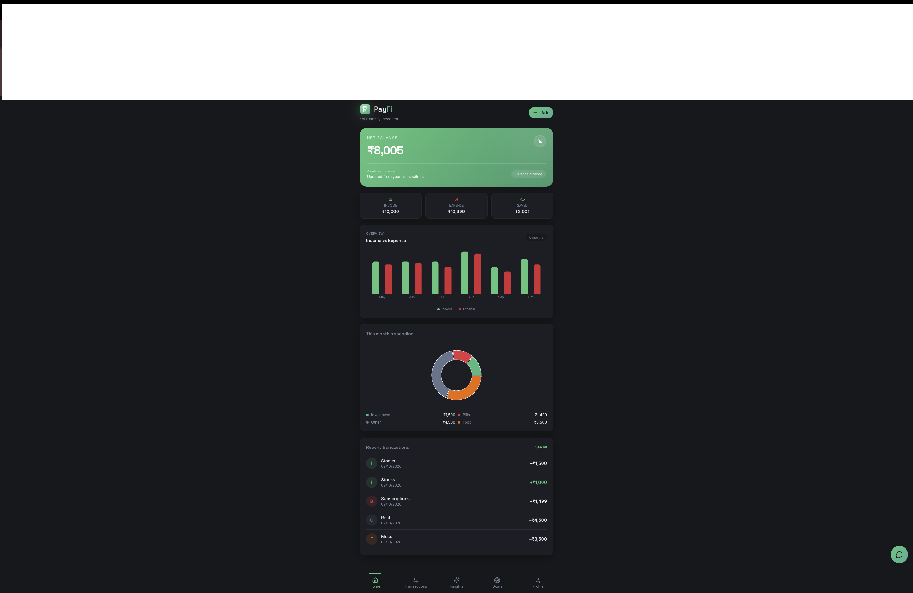
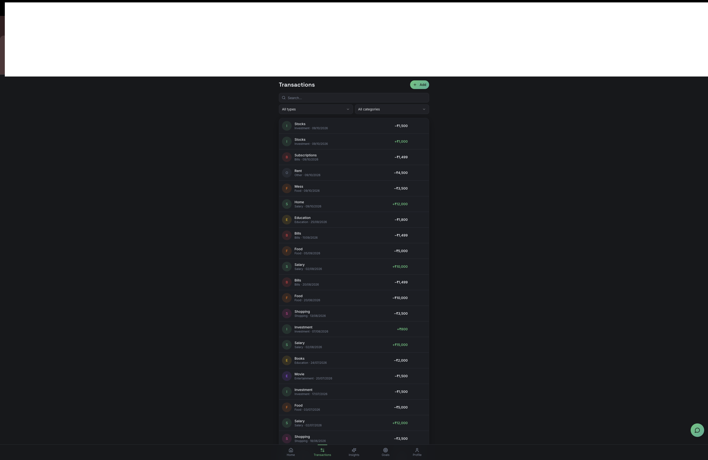
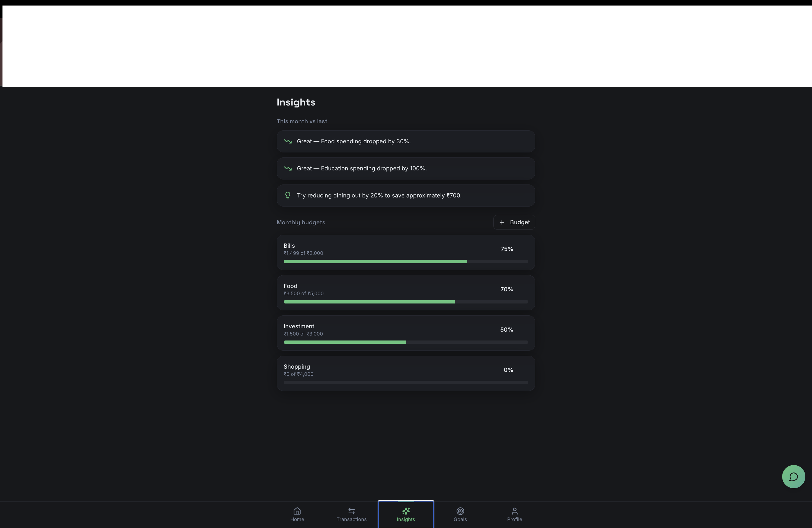
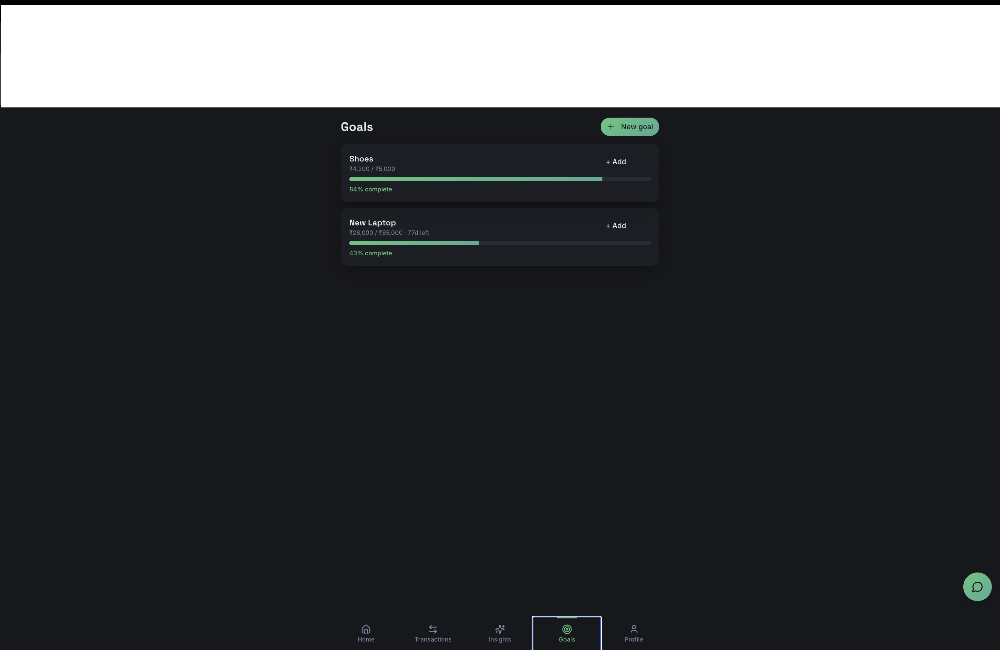
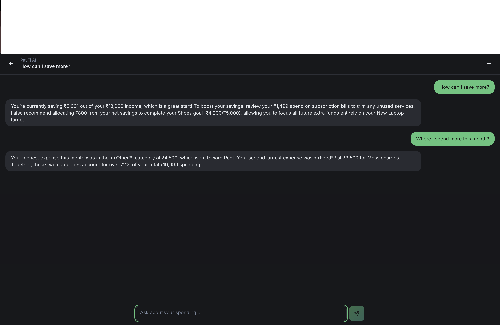
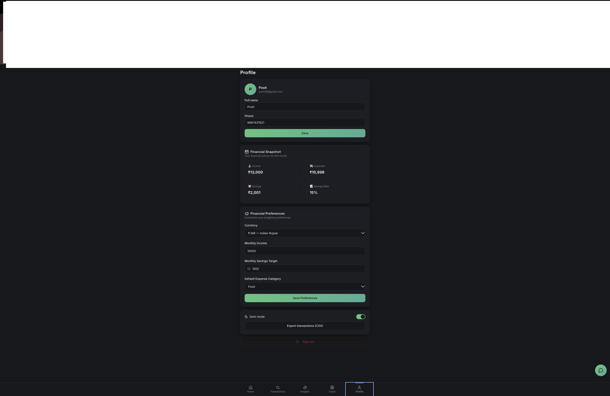

<h1 align="center">P₹ PayFi</h1>

<p align="center">
  <b>Your money, decoded.</b><br/>
  A personal finance app built for students who want to know where their money actually goes.
</p>

<p align="center">
  <a href="https://payfi-finance.vercel.app"><b>Live Demo</b></a> ·
  <a href="https://github.com/poojadahiya22/payfi">GitHub</a> ·
  <a href="https://www.linkedin.com/in/pooja-dahiya-a04012297/">LinkedIn</a>
</p>

<p align="center">
  
</p>

---

## Why I built this

I'm a student, and by the end of every month I had no idea where my money went. The expense apps I tried were just long lists of transactions. I wanted something that tells me when I'm about to overspend and keeps my savings goals in front of me, so I built it.

It's also the project where I pushed myself beyond frontend work: authentication, a real database, per-user data, an AI feature that reads your own numbers, and a production deployment.

## What it does

- **Dashboard:** balance, income, expenses and savings at a glance, a six-month income vs. expense chart, this month's spending by category, and recent transactions. There's a button to hide your balance if someone is looking over your shoulder.
- **Transactions:** add income and expenses with a category, search them, and filter by type or category.
- **Insights and budgets:** set a monthly budget for each category. The bars fill up as you spend, and you get a warning when you're close to a limit (like *"Travel budget 98% used"*).
- **Goals:** set something you're saving for with a target and a deadline, and add money to it as you go.
- **Health score:** one number that sums up how you're doing financially.
- **PayFi AI:** a chat assistant that answers questions using *your own* income, spending, categories and goals, not generic advice.
- **Profile:** a monthly snapshot, your currency and savings target, dark mode, and one-click CSV export of all your data.
- **Auth and privacy:** sign in with email or Google. Each user only sees their own data.

## Screenshots

<p align="center">
  
  
  
</p>
<p align="center">
  
  
  
</p>

<p align="center">
  <sub>Dashboard · Transactions · Insights · Goals · PayFi AI · Profile</sub>
</p>

## Tech stack

| Layer | Technology |
|-------|------------|
| Frontend | React, TypeScript, Vite |
| Styling | Tailwind CSS, shadcn/ui |
| Animation | Framer Motion |
| Charts | Recharts |
| Backend and database | Supabase (PostgreSQL) |
| Auth | Supabase Auth (email and Google) |
| Deployment | Vercel |

## Getting it live took a while

The app worked locally for months before I could deploy it. Supabase environment variables kept breaking the production build, and I couldn't figure out why. I eventually got the Supabase keys, the GitHub repo and Vercel working together, and it's live now. After that I redesigned the dashboard and profile pages.

## Run it yourself

```bash
git clone https://github.com/poojadahiya22/payfi.git
cd payfi
npm install
```

Create a `.env` file with your own Supabase project keys:

```bash
VITE_SUPABASE_URL=your_supabase_url
VITE_SUPABASE_ANON_KEY=your_supabase_anon_key
```

Then start the dev server:

```bash
npm run dev
```

## Roadmap

- [ ] Recurring transactions
- [ ] Subscription reminders
- [ ] A dedicated mobile app

## About me

Built by **[Pooja Dahiya](https://pooja-portfoliooo.netlify.app/)**, a Computer Science student who enjoys building full-stack products end to end.
Open to Software Engineer and Full-Stack Developer roles. Let's connect on [LinkedIn](https://www.linkedin.com/in/pooja-dahiya-a04012297/).

---

<sub>PayFi is a portfolio project and not financial advice.</sub>
